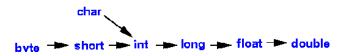
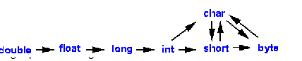

### Algoritmo 

- Finitezza
- Non ambiguita'
- Correttezza
- Generalita'
- Efficienza
- Atomicita'

### Compilati vs interpretati

| COMPILATI                                       | INTERPRETATI                                            |
| ----------------------------------------------- | ------------------------------------------------------- |
| Conversione intero codice prima dell'esecuzione | esegue le instruzioni direttamente dal  codice sorgente |
| Genera un eseguibile detto object code          | traduce ogni singola istruzione                         |
| Object code e' specifico per il sistema         | portabile                                               |
|                                                 |                                                         |

### JVM 
Una jvm per ogni specifica tipologia di elaboratore

javac -> Compilatore traduce il programma in bytecode (file .class) -> intepretato dalla jvm -> programma eseguibile

La jvm aggiunge un overhead che incide sulle prestazioni 

ClassLoader(linker) linka tra loro tutte le classi utilizzate
Verifica del bytecode
Interpretazione JIT -> linugaggio macchina

# JAVA

## Variabili e operatori

- Casting implicito, che avviene in modo automatico da parte del compilatore in caso di conversioni lossless. 
- 
- 
- Casting esplicito, che deve essere svolto manualmente dal programmatore in caso di conversioni lossy.
- 

- Costanti, dichiarate in maiuscolo con final,  

### Stringhe

- non sono un tipo primitivo 
- Memoria gestita dallo Stirng pool (heap section):
	- La jvm controlla lo String pool quando su utilizza una String, se non esiste viene creata altrimenti la variabile avra' un riferimento all'indirizzo di memoria della stringa 
- Immutabili

### Operatori Logici
- && e || sono detti short circuit perche' se la prima espressione risulta essere falsa e vera corrispettivamente la seconda parte verra' saltata
- L'operatore == in caso di dati di tipo classe verifica se i due oggetti puntano al medesimo indirizzo di memoria 

## Array e Metodi

- Gli array sono di tipo classe
- Spazi contigui di memoria in cui vengono salvate le varie posizioni dell'array 
- l'operatore =, assegna a un array lo stesso riferimento di memoria di un altro, per la copia si usa il metodo clone()
- Passaggio di un argomento puo' avvenire:
	- Per valore: l'argomento passato e' il valore della variabile, due distinti indirizz di memoria, vengono passati in questo i tipi primitivi 
	- Per argomento, il parametro nel metodo e la variabile del chiamante puntano allo stesso indirizzo di memoria, le modifiche effettuate nel metodo hanno effetto anche sulla variabili del chiamante, vengono passati in questo modod i tipi classe

- il metodo e' caratterizzata dalla sua firma (identificativo e lista parametri) percio' e' possibile l'overloading 

## Ereditarieta'

- L'ereditarietà permette di scrivere classi che condividono certe proprietà, sfruttando la riusabilità del codice: tali proprietà comuni vengono scritte una sola volta per una classe generica e viene fatto in modo che le altre classi le vadano a ereditare, evitando di ripeterle

- Classe padre -> classe che fara' ereditare le proprie caratteristiche
- classe figlia -> classe che eredita

### Tipi di ereditarieta'
- Singola
- Gerachica: piu' classi che ereditano dallo stesso padre
- Multilivello: antenati
- Multipla: figlio eredita da piu' padri (non possibile in java)
- Ibrida: diversi tipi di eredita' (non possibile in java)

- Overriding: Java consente che una classe figlia possa definire un metodo di istanza con la stessa firma e anche lo stesso tipo di ritorno di un metodo ereditato dalla classe padre: la classe figlia sta ridefinendo (overriding) il metodo della classe padre, andando a personalizzare un comportamento affinché sia maggiormente adatto a sé.

## Polimorfismo
- definizioni di metodi con corpi differenti ma stesso nome o intestazione
- Un oggetto ha due tipi:
	- Statico: tipo della dichiarazione (contiene l'indirizzo di memoria)
	- Dinamico: tipo specificato duranta l'allocazione di memoria dell'oggetto (deve essere uguale a quello statico o sua sottoclasse)

- Polimorfismo statico: compile-time, consiste nell'overload dei metodi
- Polimorfismo dinamico: exec-time: override metodi (principalmente usato da java)

## Astrazione
- Struttura senza implementazione 
- Generalizzazione che sara' condivisa da tutte le sottoclassi
- A partire da una classe astratta non si puo' creare un oggetto 
- Ogni metodo astratto deve essere ridefinito dalla classi derivate => overriding obbligatorio
- Un oggetto non puo' avere tipo dinamico una classe astratta ma puo' averlo come tipo statico

### Interfaccia

- Consiste in una "check-list" di metodi che ogni classe deve implementare
- metodi senza corpo
- no costruttori
- no variabili di instanza
- E' possibile combinare interfacce
