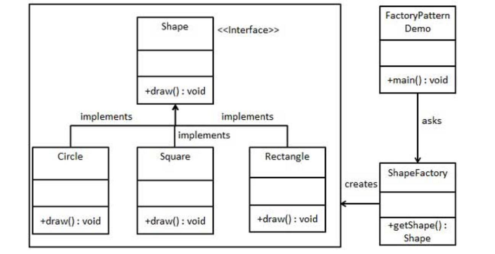

## Eccezioni

Una situazioni di errore => eccezione 
- puo' essere catturata per gestire poi l'errore
- java runtime default => errore

Exception e una vera e propria classe di Java e le eccezioni sono oggetti di essa 

### Gestione Eccezioni

```Java
try {  
	//some code that could launch an exception
} catch (ExceptionA eA) {
	//some code to catch the exception called (blocco di ripristino)
} catch (ExceptionB eB) {
	//some code to catch the exception called (blocco di ripristino)

} finally {
	//some code that will be executed nmw
}
```

E' possibile gestire vari tipi di eccezioni lanciate dallo stesso codice mettendole a cascata dalla piu' specifica a quella meno


### Exception Custom

La classe exception (che e' estensione di Throwable) puo' essere estesa come qualsiasi altra classe

```Java
public class ErroreStringaVuota extends Exception {
	ErroreStringaVuota() {
		super("Stringa non inizializzata");
	}
}
```

Va dichiarato il metodo di throw tramite la keyword throws
```Java
public void stampa (String a) throws ErroreStringaVuota {
		/* Significa che questo metodo può 
		lanciare un'eccezione di tipo
		ErroreStringaVuota */
	if (a == null) throw new ErroreStringaVuota();
	else System.out.println(a);
}
```

throws serve a indicare che un metodo puo' fallire e deve essere seguito dai tipi di eccezioni che possoon essere lanciati. 

### Risoluzione di eccezioni

-  aiuta il debug:
	- `printStackTrace()` stampa la posizione 
	- `getMessage()` restituisce la descrizione della anomalia
- Correzioni dell'anomalia nel blocco catch
- Ripristino dello stato precendente

### Tipi di anomalie

- JVM Error
	- Classe Error
	- Irrecuperabili
	- ES: memoria esaurita, stack overflow
- Program Error
	- Classe Exception
	- Gestiti in modo esplicito
	- RuntimeException
	


## I/O

Stream: sequenze continue e monodirezionali di informazioni che transitano da un'entita' all'altra
- i dati possono essere:
	- Omonogenei/eterogenei
	- Semplici/composti

Packaga java.io gestire i flussi di dati

### File 

java.io.File -> rappresentazione astratta di un file o di una directory, permette di creare, eliminare, cercare e rinominare un file

java.io.FileReader -> permette di leggere i caratteri contenuti in un file uno ad uno

java.io.BufferedReader -> simile al FileReader ma legge in blocchi e vengono memorizzati in un buffer (migliorano le prestazioni)

java.io.FileWriter -> permette di scrivere i caratteri in un file uno alla volta

java.ioBufferedWriter -> permette di scrivere in un buffer temporaneo che viene letto periodicamente e poi scritti sul file


#### Metodi 
- `exists()` bool se il file esisite
- `createNewFile()` crea un file su disco
- `delete()` cancella un file da disco
- `isFile()` controlla che sia un file 
- `isDir()` contralla che sia una directory
- `mkDir()` crea una directory 
- 
	<span style="color:red">importanti, vanno sempre chiamati a fine utilizzo</span>
- `flush()` pulisce il buffer  
- `close()` chiude il writer o il reader

```Java

try{
	File file1 = new File(path);
	
	if (file1.exists())
		System.out.println(“Il file ” + path + ” esiste”);
	else if (file1.createNewFile())
		System.out.println(“Il file ” + path + ” è stato creato”);
	else
		System.out.println(“Il file ” + path + ” non può essere creato”);
		
}catch (Exception e) {
	e.printStackTrace();
}
```

Il FileWriter viene creato passando un file 
Il BufferWriter viene creato passando un fileWriter
Lo stesso avviene per il reader


```Java
public static void writeBufferFile() {
	String path = “C:\\file.txt”;
	try {
		File file = new File(path);
		FileWriter fw = new FileWriter(file);
		BufferedWriter bw = new BufferedWriter(fw);
		bw.write(“Questo è il nostro primo file”);
		bw.flush();
		bw.close();
		fw.close();
	}catch(IOException e) {
		e.printStackTrace();
	}
}
```


## SW Design Pattern

### Singleton

Come dice il nome questo pattern si assicura che una classe abbia una ed una sola istanza e un unico punto di accesso

Costruttori privati per evitare che vengano istanziate in maniera arbitraria
Esiste un metodo statico apposito per assicurarsi che non vengono create altre istanze

Il Singleton mantiene il riferimento all'unica istanza Singleton e la restituisce ad ogni tentativo di crearne una nuova

```java
public class Stampante {
	private static Stampante s; //the single instance
	
	public static Stampante getInstance(){
	//build the unique object only if it does not exist already
		if (s == null)
			s = new Stampante();
		return s;
	}
}
```


### Factory Pattern 

Il factory pattern permette di creare nuovi oggetti senza dover specificare la propria classe, questo avviene perche' viene chiamato un `factory method` invece di un costruttore



```java
public interface Shape {
   void draw();
}

public class Rectangle implements Shape {

   @Override
   public void draw() {
      System.out.println("Inside Rectangle::draw() method.");
   }
}

public class Square implements Shape {

   @Override
   public void draw() {
      System.out.println("Inside Square::draw() method.");
   }
}

public class Circle implements Shape {

   @Override
   public void draw() {
      System.out.println("Inside Circle::draw() method.");
   }
}

public class ShapeFactory {
	
   //use getShape method to get object of type shape public Shape getShape(String shapeType){
      if(shapeType == null){
         return null;
      }		
      if(shapeType.equalsIgnoreCase("CIRCLE")){
         return new Circle();
         
      } else if(shapeType.equalsIgnoreCase("RECTANGLE")){
         return new Rectangle();
         
      } else if(shapeType.equalsIgnoreCase("SQUARE")){
         return new Square();
      }
      
      return null;
   }
}

```


### Abstract Factory Pattern
Funziona come il factory pattern ma al posto di creare nuovi oggetti crea nuove factory


```java
//Shape interface
public interface Shape {
   void draw();
}
//--------------CLASSI CONCRETE--------------//
public class RoundedRectangle implements Shape {
   @Override
   public void draw() {
      System.out.println("Inside RoundedRectangle::draw() method.");
   }
}

public class RoundedSquare implements Shape {
   @Override
   public void draw() {
      System.out.println("Inside RoundedSquare::draw() method.");
   }
}

public class Rectangle implements Shape {
   @Override
   public void draw() {
      System.out.println("Inside Rectangle::draw() method.");
   }
}


//---------------FACTORY PER NORMAL O ROUNDED SHAPES-----------//
public abstract class AbstractFactory {
   abstract Shape getShape(String shapeType) ;
}

//-------------CLASSI FACTORY PER CREARE OGGETTI CONCRETI---------//
public class ShapeFactory extends AbstractFactory {
   @Override
   public Shape getShape(String shapeType){    
      if(shapeType.equalsIgnoreCase("RECTANGLE")){
         return new Rectangle();         
      }else if(shapeType.equalsIgnoreCase("SQUARE")){
         return new Square();
      }	 
      return null;
   }
}

public class RoundedShapeFactory extends AbstractFactory {
   @Override
   public Shape getShape(String shapeType){    
      if(shapeType.equalsIgnoreCase("RECTANGLE")){
         return new RoundedRectangle();         
      }else if(shapeType.equalsIgnoreCase("SQUARE")){
         return new RoundedSquare();
      }	 
      return null;
   }
}

//-------FACTORY PRODUCER PER GENERARE LE FACTORY------------//
public class FactoryProducer {
   public static AbstractFactory getFactory(boolean rounded){   
      if(rounded){
         return new RoundedShapeFactory();         
      }else{
         return new ShapeFactory();
      }
   }
}

//----------------IMPLEMENTAZIONE----------------------//

public class AbstractFactoryPatternDemo {
   public static void main(String[] args) {
      //get shape factory
      AbstractFactory shapeFactory = FactoryProducer.getFactory(false);
      //get an object of Shape Rectangle
      Shape shape1 = shapeFactory.getShape("RECTANGLE");
      //call draw method of Shape Rectangle
      shape1.draw();
      //get an object of Shape Square Shape shape2 = shapeFactory.getShape("SQUARE");
      //call draw method of Shape Square
      shape2.draw();
      //get shape factory
      AbstractFactory shapeFactory1 = FactoryProducer.getFactory(true);
      //get an object of Shape Rectangle
      Shape shape3 = shapeFactory1.getShape("RECTANGLE");
      //call draw method of Shape Rectangle
      shape3.draw();
      //get an object of Shape Square Shape shape4 = shapeFactory1.getShape("SQUARE");
      //call draw method of Shape Square
      shape4.draw();
      
   }
}
```


## Interfacce

Le interfacce vengono usate per aggirare il limite sull'ereditarieta' multipla

Una interfaccia non e' una classe, e' senza variabili, senza costruttore e i metodi sono solo dichiarati

Le interfacce non sono istanziabili

Sono importarti per l'ereditarieta' perche' una classe puo' implementare multiple interfacce e piu' classi possono implementare una stessa interfaccia.
Estensione e implementazioni di interfacce non cozzano


## Lambda

Le funzioni lambda sono un modo per creare una funzione anonima che puo' essere passato come argomento o restituita in uscita nei metodi
Sono dei metodi senza dichiarazione 

Sono particolarmente utili in casi di brevi funzioni non utilizzate piu' volte

Esempio di utilizzo: 
eventHandler per JavaFX o Swing 
```Java
JButton testButton = new JButton("test button");
testButton.addActionListener(new ActionListener() {
	@override
	public void actionPerformed(ActionEvente ae){
		System.out.println("test button pressed");
	}
	})
```

Le ActionListener sono dette interfacce funzionali perche' sono caratterizzate da un solo metodo

### Sintassi

```Java
(arg1,arg2,arg3) -> {//istruzioni
}

(int x, int y) -> x + y;
s -> s.length();
() -> 50;
(String s) -> {System.out.println("Benvenuto");
			  System.out.println(s);}
```


### Esempi
```java
public class Java8Tester {
	public static void main(String args[]){
	Java8Tester tester = new Java8Tester();
	//with type declaration
	MathOperation addition = (int a, int b) -> a + b;
	//with out type declaration
	MathOperation subtraction = (a, b) -> a - b;
	//with return statement along with curly braces
	MathOperation multiplication = (int a, int b) -> { return a * b; };
	//without return statement and without curly braces
	MathOperation division = (int a, int b) -> a / b;

	System.out.println("10 + 5 = " + tester.operate(10, 5, addition));
	System.out.println("10 - 5 = " + tester.operate(10, 5, subtraction));
	System.out.println("10 x 5 = " + tester.operate(10, 5, multiplication));
	System.out.println("10 / 5 = " + tester.operate(10, 5, division));
	//with parenthesis
	GreetingService greetService1 = message ->
	System.out.println("Hello " + message);
	//without parenthesis
	GreetingService greetService2 = (message) ->
	System.out.println("Hello " + message);
	greetService1.sayMessage("Mahesh");
	greetService2.sayMessage("Suresh");
	}
```

```Java
	interface MathOperation {
	int operation(int a, int b);
	}
	interface GreetingService {
	void sayMessage(String message);
	}
	private int operate(int a, int b, MathOperation mathOperation){
	return mathOperation.operation(a, b);
	}
}
```

L'interfaccia Predicate puo' essere utile con le lambda

```Java
public interface Predicate<T> {
	public boolean test(T t);
}

public List<Persona> getIscrittiFiltratiPer(Predicate<Persona> pred){
	List<Persona> persone = new ArrayList<Persona>();
	for (Persona p:iscritti)
		if (pred.test(p))
			persone.add(p);
	return persone;
}

Predicate<Persona> allGiovaniDonne = p -> p.getSesso().equals("F") && p.getEta() > 17 && p.getEta() < 30;

Predicate<Persona> allMaschi = p -> p.getSesso().equals("M");
Predicate<Persona> allStranieri = p -> !p.getNazionalita().equals("italiana");
```


Altri esempi con gli stream:
```Java
for (Album album : albums)
	if (album.getYear() < 2000)
		System.out.println(album.getAuthor());
//e quella in Java 8 con gli stream.
albums.stream()
	.filter(album -> album.getYear() < 2000)
	.map(Album::getAuthor)
	.forEach(System.out::println);
```
Nel primo caso iteriamo in maniera esterna gli elementi all'interno della lista

Nel secondo caso usiamo l'interfaccia <span style="color:red">stream </span> che restituisce un flusso di dati (infinito o finito) su cui e' possibile fare operazioni di filtro, mappa e riduzione. Puo' essere fatto in modo parallelo o sequenziale


## Stream

Lo stream e' una pipeline di operazioni sui dati

- Sorgente: l'inizio di uno stream puo' essere generato in diversi modi, usando una collection, stream infinito, stream di Path, ecc...
- Operazioni intermedie: 
	- Queste operazioni sono "lazy" => il dato non viene eleborato, l'elaborazione avviene nel passo finale. 
	- Le operazioni intermedie restituiscono un nuovo stream
	- Passo per passo :
```Java
Stream<Album> stream1 = albums.stream();
Stream<Album> stream2 = stream1.filter(album -> album.getYear() < 2000);
Stream<String> stream3 = stream2.map(Album::getAuthor);
stream3.forEach(System.out::println);
```
filter restituisce uno stream che soddisfa un predicate

Map invece permette di cambiare il tipo di oggetti nello stream
```Java 
<R> Stream<R> map(Function<? super T, ? extends R> mapper);
```

- Operazione terminale:
	- Agisce effettivamente sui dati
	- utilizzare forEach, costruire liste, somma o medie di numeri, ecc

Flatmap e' un metodo che presa in input una funzione T -> R Stream, il metodo poi esegue un raggruppamento degli stream in unico stream
```Java
<R> Stream<R> flatMap(Function<? super T,? extends Stream<? extends R>> mapper)
```

Gli stream permettono inoltre di implementare in maniera semplice il parallelismo con `parallelStream()`

Le operazioni in parallelo non sono deterministiche percio' non bisogna usarle se devo modificare dati del sorgente e le lambda devono essere stateless


## Reti

Sulla rete i computer comunicano scambiandosi pacchetti di dati (IP packet) che viaggiano attraverso i nodi della rete, algoritmi di routing(bellman-ford, dijkstra, ecc) ne determinato il percorso

### Tipi di comunicazione:

Client-Server
- client: effettua la richiesta
- Server: in attesa della richiesta da servire

P2P:
- ogni host fa anche da client

### Protocolli

- TCP
	-  Offers reliable data transfer.
	- Guarantees in-order delivery and error-free data.
	- Useful for applications where data integrity is crucial (file transfers, web browsing).
	- Slower due to overhead for error checking and retransmission.
	- Triple handshake
- UDP
	- connectionless data transfer
	-  No guarantees on delivery, order, or error correction.
	- Faster than TCP due to less overhead.expand_more
	- Useful for real-time applications where speed is a priority 
- RMI
	- A Java-specific technology for making remote procedure calls.expand_more
	- Makes distributed programming easier by allowing objects on different machines to interact.
	- Built on top of Java's networking features, typically using TCP for reliable data transfer.
	- Offers a higher level of abstraction compared to raw sockets (TCP/UDP).
	- Focuses on method calls and object serialization for remote invocation.


### Definizioni

- Hosts: dispositivi connessi a internet
- Indirizzo IP: permette di identificare in modo univoco i computer collegati alla rete
- DNS (domain name system): 
	- indirizzi numerici sono mappati con nomi human-readable dal DNS
	- Ogni sito ha un suo domain name server che traduce IP <=> DNS
	- DNS e' un sistema distribuito
- Protocollo: insieme di regole formalmente descritte 
	- TCP 
		- È un protocollo di alto livello:
		- È orientato alla connessione;
		- Esegue controlli sugli errori, congestione e flusso di comunicazione

		- Un destinatario TCP è identificato da un indirizzo IP (Internet Protocol) e da una porta di destinazione.
			- L’indirizzo IP identifica la macchina alla quale vogliamo collegarci.
			- Il numero
	- UDP
	- HTTPS
	- IP


### URL
Uniform resource locator e' un metodo per identificare univocamente la locazione della risorsa su internet, puo' essere qualsiasi cosa, directory, file o oggetto in rete
Gli URL sono svariati, ognuno con un protocollo diverso, ma i più usati sono quelli che
usano protocolli HTTP (HyperText transfer Protocol) e FTP (File transfer Protocol).
A differenza dei web browser, l’http:// davanti all’indirizzo è indispensabile, perché individua
il protocollo dell’URL, protocollo che il Navigator e l’Explorer intuiscono anche se omesso.
Un URL consiste di 4 componenti:
1. il protocollo separato dal resto dai due punti (esempi tipici di protocolli sono http, ftp, news, file, ecc.);
2. il nome dell’host, o l’indirizzo IP dell’host, che è delimitato sulla sinistra da due barre (//), e sulla destra da
una sola (/), oppure da due punti (:)
3. il numero di porta, separato dal nome dell’host sulla sinistra dai due punti, e sulla destra da una singola
barra. Tale componente è opzionale, in quanto, come già detto, ogni protocollo ha una porta di default
4. il percorso effettivo della risorsa che richiediamo. Il percorso viene specifica- to come si specifica un path
sotto Unix. Se non viene specificato nessun file, la maggior parte dei server HTTP aggiunge
automaticamente come file di default index.html.

Una query ad un particolare servizio è costituita quindi da un normale URL, con in coda alcuni
parametri. La parte dell’URL che specifica i parametri inizia con un punto interrogativo (?). Ogni
parametro è separato da una “e commerciale” (&), e i valori che si assegnano ai parametri sono
specificati in questo modo: nome = valore (il valore è facoltativo).


### In Java

- URL(String spec): crea un oggetto URL 
- URL(String protocol, String Host, int port, String file), crea un oggetto URL completo
- URL(String protocol, String Host, int port, String file, URLStreamHandler handler)
- URL(String protocol, String host, String file), crea un oggetto URL specificando
protocollo, host e File sul server host

Esistono anche:
- equals()
- getContent()
- getFile()
- getHost()
- getPort()
- getProtocol()
- URLConnection openConnection(): apre una connessione
- InputStream openStream(): apertura connessione con stream in lettura

```Java
try {
	URL u = new URL(“http://www.android.com/user.html“);
	System.out.println("The protocol is " + u.getProtocol());
	System.out.println("The host is " + u.getHost());
	System.out.println("The port is " + u.getPort());
	System.out.println("The file is " + u.getFile());
	System.out.println("The anchor is " + u.getRef());
}
```
```Java
public class IndirizziIP {
	public static void main(String [] args) {
		String dom=”www.sun.com”;
			try {
				InetAddress loc=InetAddress.getByName(dom);
				System.out.println(“IP di “+dom+” : “+loc.getHostAddress());
			}
			catch (UnknownHostException e)
			{System.out.println(“Dominio non esiste “+dom);}
			
			try {
				InetAddress loc=InetAddress.getLocalHost();
				System.out.println(“IP locale: “+loc.getHostAddress());
				System.out.println(“Nome locale ”+loc.getHostName());
			}
			catch (UnknownHostException e)
				{}
	}
}
```

### MIME 
Acronimo di Multipurpose Internet Mail Extensions, utilizzato inizialmente per messaggi di mail, ma usato per HTTP, ogni richiesta del browser al server invia anche un header MIME
``` HEADER_RICHIESTA 
GET /javafaq/images/cup.gif HTTP/1.0
Connection: Keep-Alive
User-Agent: Mozilla/3.01 (Macintosh; I; PPC)
Host: www.oreilly.com:80
Accept: image/gif, image/x-xbitmap, image/jpeg, */*
```
```HEADER_RISPOSTA
HTTP/1.0 200 OK
Server: Netscape-Enterprise/2.01
Date: Sat, 02 Aug 1997 07:52:46 GMT
Accept-ranges: bytes
Last-modified: Tue, 29 Jul 1997 15:06:46 GMT
Content-length: 2810
Content-type: text/html
```

Ottenere attributi
```Java
try {
	URL u = new URL("http://www.expo.it/");
	URLConnection uc = u.openConnection();
	uc.connect();
	String key=null;
	for (int n = 1;	(key=uc.getHeaderFieldKey(n)) != null;	n++) {
		System.out.println(key + ": " + uc.getHeaderField(key));
	}
}
catch (IOException e) {
	System.err.println(e);
}
```

Richieste REST:
- **GET**: per leggere dati da remoto senza apportare modifiche
- **PUT**: richiedere modifica dati esistenti
- **POST**: per inviare dati verso il servizio con lo scopo di richiederne l’inserimento nella base dati
- **DELETE**: cancellare il dato
Risposte:
- 200 -> OK
- 400 -> Bad Request
- 403 -> Forbidden
- 404 -> Not Found
- 500 -> internal server error


### JSON 
Il JSON (Javascript Object Notation) è un formato stringa per la rappresentazione di dati organizzati in oggetti e array.
I tipi di dati supportati da questo formato sono:
- booleani (true e false)
- numeri: interi, reali, virgola mobile
- stringhe racchiuse da doppi apici "
- array: sequenze ordinate di valori, separati da virgole e racchiusi in parentesi quadre [ ]
- array associativi: sequenze coppie chiave-valore separate da virgole racchiuse in parentesi
graffe { }


## Pattern Architetturali

### Model-View-Controller (MVC)

Uno dei pattern piu' diffusi nella OOP e GUI poiche' aumenta la coesione -> ogni oggetto puo' ricoprire solo uno dei modelli di: ruolo, vista o controllore. Essi sono logicamente separati ma possono comunicare tra loro
- Model: contiene i dati specifici dell'applicazione e definisce tutte le varie procedure che effettuano manipolazione dei dati in lettura o scrittura. Non ha connessione diretta con un oggetto di tipo view, in quanto ha il compito di gestire dati che non devono essere legati a delle visualizzazioni particolari
- View: ha il compito di presentare all'utente i dati contenuti all'interno di un modello. 
	- Il modello di un oggetto non e' concreto mentra la view e' qualcosa con il quale l'utente puo' interagire
	- Mette a disposizione un'interfaccia per la modifica dei dati contenuti nei modelli
	- La vista non deve avere un riferimento esplicito a un modello
- Controllore: Intermediario tra vista e modelli
	- Puo' avere relazioni arbitrarie tra oggetti modelli e viste (1:1 fino N:N)
	- Il controllore inizializza la vista con i dati contenuti nel modello, e informare le modifiche dei dati


## Database

Collezione di dati che viene gestita e organizzata da un DBMS

La rappresentazioni logica dei dati in un database o "Schema del database"

- Gerarchici: relazioni di possesso tra dati, un insieme di dati puo' possedere altri insiemi di dati ma un un insieme di dati puo' appartenere solo ad un altro insieme 
- Reticolari: uguale al gerarchico senza la restrizione di appartenza ad un solo insieme
- Relazionali: Righe Colonne 
- Ad oggetti: Schema dei dati e' un insieme di classi che definiscono il comportamento degli oggetti. I dati non sono passivi come negli altri database


### DAO 
Data-access Object e' un pattern architetturale per la gestione della persistenza, si tratta
fondamentalmente di una classe con relativi metodi che rappresenta un'entità tabellare di un RDBMS,
usata principalmente in applicazioni web sia di tipo Java EE sia di tipo EJB, per stratificare e isolare
l'accesso ad una tabella tramite query (poste all'interno dei metodi della classe) ovvero al data layer
da parte della business logic creando un maggiore livello di astrazione ed una più facile manutenibilità.

Il DAO permette di tenere separate le componenti di una applicazione


### DB in JAVA

La tecnologia Java ha ottenuto anche molto successo grazie all'accesso al Database JDBC,
concorrenziale all'ormai noto ODBC.
Nell'ottica multipiattaforma le connessioni JDBC sono studiate per potersi collegare a qualsiasi motore
database, indipendentemente da esso e dalla piattaforma di utilizzo.
JDBC è l'acronimo di Java DataBase Connectivity: 
- Connection
- Driver
- Statement
- PreparedStatement
- CallableStatement
- ResultSet
- ResultSetMetaData
- DatabaseMetaData


Passi essenziali
- Caricare Driver
- Aprire connessione al database
- Creare oggetto Statement
- Interagire con il DB
- Gestire risultati della ResultSet


```java
import java.sql.*;

public class ProvaJDBC {
	public static void main (String args[]){
		try {
			String driver = “com.mysql.jdbc.Driver”;
			Class.forName(driver);
			String url = “jdbc:mysql://172.16.94.50/databaseName”;
			Connection con = DriverManager.getConnection(url, "corsojava", "javapassword");
			Statement cmd = con.createStatement();
			String query = "SELECT * FROM nomeTabella";
			ResultSet res = cmd.executeQuery(query);
			while (res.next()) {
				System.out.println(res.getString("nomeColonna1"));
				System.out.println(res.getString("nomeColonna2"));
			}
			res.close(); // chiudere le risorse DB è obbligatorio
			cmd.close();
			con.close();
		}catch (SQLException e){
			e.printStackTrace();
		}catch (ClassNotFoundException e){
			e.printStackTrace();
		}
	}
}
```

executeQuery() di Statement e' possibile eseguire Query che vengono salvate su un ResultSet
`next()` molto importante per scorrere il risultato della query
`close()` per ogni oggetto aperto, ResultSet, Statement e Connection
`SQLException()` per errori di SQL


## GUI

### Frame
Un frame e' una superficie rettangolare provvista di una barre del titolo con titolo, icone e i tasti funzione della finestra

JFrame permette di avere diversi pannelli nello stesso frame
- Root Pane, il piu' basso
- Glass Pane => cattura le azioni del mouse
- Layered Pane => contiene il menu e il content Pane
- Content Pane => contiene gli elementi della GUI

Chiusura finestra => `setDefaultCloseOperation(int type)` oppure con `setDefaultCLoseOperation(JFrame.EXIT_ON_CLOSE)`


### Toolkit

`getDefaultToolkit()` per ottenere l'istanza del toolkit con cui otteniamo informazioni sulle caratteristiche del dispositivo
`Dimension getScreenSize()` => restituisce le dimensioni dello schermo in pixel da cui possiamo ottenere `getHeight()` e `getWidth()`

### Menu 
Il menu non va aggiunto al content pane di un jFrame, ma direttamente al JFrame tramite `void setjMenuBar(jMenuBar jmb)` 
Il menu e' una struttura gerarchica con menu' che contengono menu'

### Layout
Oggetto che permette di disporre gli elementi della GUI dentro i container. Suddivide la finestra in zone e permette di inserire in zone specifiche gli elementi
`void setLayout(LayoutManager Im)` con le seguenti classi:
- `FlowLayout` riempe da sinistra a destra riempendo le righe
- `FlowLayout()`
- `FlowLayout(int align)`
- `FlowLayout(int align, int hgap, int vgap)`, align assume `LEFT,CENTER,RIGHT`
- `BorderLayout` suddivide il contenitore in zone (`North, South, East, West, Center`)
